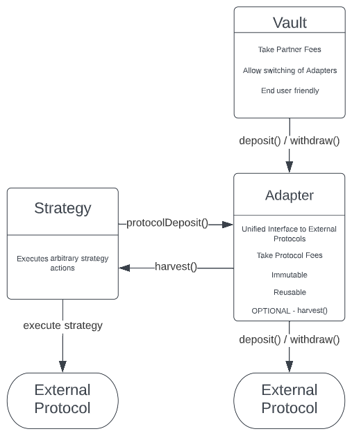

# Overview

This protocols goal is to make vault creation easy, safe and all without compromising on flexibility. It allows anyone to spin up their own Yearn in minutes.

**Vaults** can be created permissionlessly based on any underlying protocol and execute arbitrary strategies. 
The factory uses only endorsed **Adapters** and **Strategies** with minimal user input to reduce complexity for a creator and ensure safety of the created clones. It gives vault creators a quick and easy way to spin up any **Vault** they need and end users the guarantee that the created **Vault** will be safe. For some more context checkout the [whitepaper](./WhitePaper.pdf)

The protocol consists of 2 parts. The Vault Factory and the actual Vaults and Adapters.

## Vault Factory
The Vault Factory part consists of a mix of Registry and Execution contracts. All contracts are immutable but execution contracts can be swapped out if requirements change or additional functionality should be added.

-   **CloneFactory:** A simple factory that clones and initializes new contracts based on a **Template**.
-   **CloneRegistry:** A minimal registry which saves the address of each newly created clone.
-   **TemplateRegistry:** A registry for **Templates**. Each Template contains an implementation and some metadata to ensure proper initialization of the clone. **Templates** need to be endorsed before they can be used to create new clones. Anyone can add a new **Template** but only the contract owner can endorse them if they are deemed correct and safe.
-   **DeploymentController:** This contract bundles **CloneFactory**, **CloneRegistry** and **TemplateRegistry** to simplify the creation of new clones and ensure their safety.
-   **PermissionRegistry:** A simple registry to endorse or reject certain addresses from beeing used. Currently this is only used to reject potentially unsafe assets and in the creation of beefy adapters.
-   **VaulRegistry:** This registry safes new **Vaults** with additional metadata. The metadata can be used by any frontend and supply it with additional informations about the vault.
-   **VaultController:** This contract bundles all previously mentioned contracts. It adds additional ux and safety measures to the creation of **Vaults**, **Adapters** and **Staking** contracts. Any management function in the protocol must be executed via the **VaultController**.
-   **AdminProxy:** This contract owns any clone and most infrastructure contracts. Its used to make ownership transfers easy in case the **VaultController** should get updated. This contracts forwards almost all calls from the **VaultController**.

**Note:** This system ensures that minimal user input is needed and executions are handled with valid inputs and in the correct order. The goal is to minimize human error and the attack surface. A lot of configurations for **Adapters** and **Strategies** is very protocol specific. These are therefore mainly handled in the implementations itself. **Adapters** should receive all there critical data from an on-chain registry of the underlying protocol. As its nearly impossible to tell otherwise if the passed in configuration is malicious. There is still a need for some kind of governance to ensure that only correct and safe **Templates** are added and dangerous assets get rejected. 

## Vault, Adapter & Strategy
-   **Vault:** A simple ERC-4626 implementation which allows the creator to add various types of fees and interact with other protocols via any ERC-4626 compliant **Adapter**. Fees and **Adapter** can be changed by the creator after a ragequit period.
-   **Adapter:** An immutable wrapper for existing contract to allow for ERC-4626 compatability. Optionally adapters can utilize a **Strategy** to perform various additional tasks besides simply depositing and withdrawing token from the wrapped protocol. PopcornDAO will collect management fees via these **Adapter**.
-   **Strategy:** An arbitrary module to perform various tasks from compouding, leverage or simply forwarding rewards. Strategies can be attached to an **Adapter** to give it additionaly utility.



## Utility Contracts
Additionally we included 2 utility contracts that are used alongside the vault system.
-   **MultiRewardStaking:** A simple ERC-4626 implementation of a staking contract. A user can provide an asset and receive rewards in multiple tokens. Adding these rewards is done by the contract owner. They can be either paid out over time or instantly. Rewards can optionally also be vested on claim.
-   **MultiRewardEscrow:** Allows anyone to lock up and vest arbitrary tokens over a given time. Will be used mainly in conjuction with **MultiRewardStaking**.


# Additional Context

**Note:** The `AdapterBase.sol` still has a TODO to use a deterministic address for `feeRecipient`. As we didnt deploy this proxy yet on our target chains it remains a placeholder value for the moment. Once the proxy exists we will simply switch out the palceholder address.

All `Adapters`, `Vaults`, `Strategies` and `MultiRewardStaking` contracts are intended to be deployed as non-upgradeable clones.

Contracts in `src/vault/strategy` are intended as samples of how strategies could look like but are in the current state still wip. They are NOT part of the audit.


# Security
There are multiple possible targets for attacks.
1. Draining user funds of endorsed vaults
2. Draining user funds with malicious vaults/adapter/strategies or staking contracts
3. Draining user funds with malicious assets
4. Grieving of management functions

### Dangerous Attacks
- Attack infrastructure to insert malicious assets / adapters / strategies
  - Set malicious `deploymentController`
  - Get malicious `Template` endorsed
  - Get malicious `asset` endorsed
- Initial Deposit exploit (See the test in `YearnAdapter.t.sol`)
- Change `fees` of a vault to the max amount and change the `feeRecipient` to the attacker
- Exchange the adapter of a vault for a malicious adapter
- Nominate new `owner` of the `adminProxy` to change configurations or endorse malicious `templates`
## Grieving Attacks
- Set `harvestCooldown` too low and waste tokens and gas on harvests
- Add a multitude of templates to make identifing the legit template harder in the endorsement process
- `Reject` legit vaults / assets
- `Pause` vaults / adapters of other `creators`
- Predeploy deterministic proxies on other chains

Most of these attacks are only possible when the `VaultController` is misconfigured on deployment or its `owner` is compromised. The `owner` of `VaultController` should be a MultiSig which should make this process harder but nonetheless not impossible.

## Inflation Attack
EIP-4626 is vulnerable to the so-called [inflation attacks](https://ethereum-magicians.org/t/address-eip-4626-inflation-attacks-with-virtual-shares-and-assets/12677). This attack results from the possibility to manipulate the exchange rate and front run a victim’s deposit when the vault has low liquidity volume.  A similiar issue that affects yearn is already known. See Finding 3, "Division rounding may affect issuance of shares" in [Yearn's ToB audit](https://github.com/yearn/yearn-security/blob/master/audits/20210719_ToB_yearn_vaultsv2/ToB_-_Yearn_Vault_v_2_Smart_Contracts_Audit_Report.pdf) for the details. In order to combat this we are using virtual shares by a difference of 1e9. This approach was added in the latest release of openZeppelin. [OZ PR](https://github.com/OpenZeppelin/openzeppelin-contracts/pull/3979)

# Tests
## Quickstart command
`export ETH_RPC_URL="<your-eth-rpc-url>" && export POLYGON_RPC_URL="<your-polygon-rpc-url>" && rm -Rf 2023-01-popcorn || true && git clone  https://github.com/code-423n4/2023-01-popcorn.git -j8 --recurse-submodules && cd 2023-01-popcorn && echo -e "ETH_RPC_URL=$ETH_RPC_URL\nPOLYGON_RPC_URL=$POLYGON_RPC_URL" > .env && foundryup && forge install && yarn install && forge test --no-match-contract 'Abstract' --gas-report`
## Prerequisites

-   [Node.js](https://nodejs.org/en/) v16.16.0 (you may wish to use [nvm][1])
-   [yarn](https://yarnpkg.com/)
-   [foundry](https://github.com/foundry-rs/foundry)


## Installing Dependencies

```
foundryup

forge install

yarn install
```

## Testing

```
Add RPC urls to .env

forge build

forge test --no-match-contract 'Abstract'
```