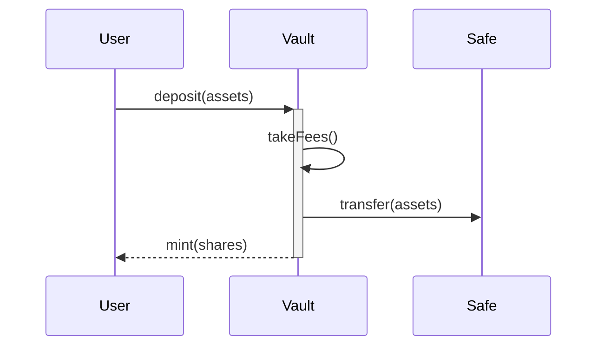
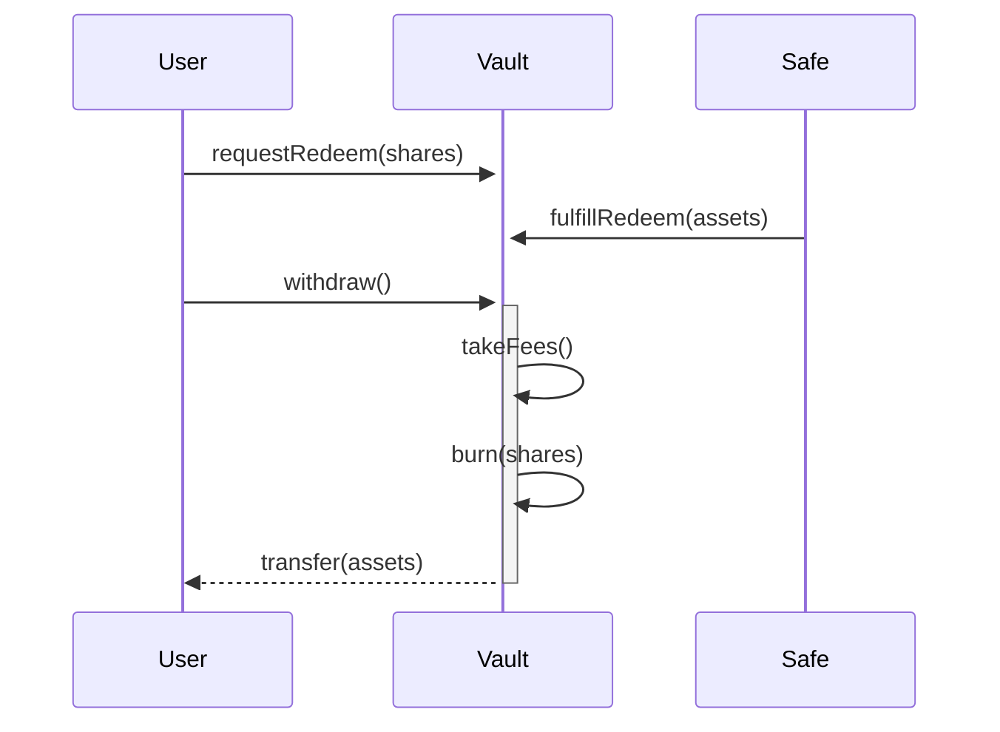

To faciliate the fast changing needs of DeFi we create a vault that can grow with us into any direction we require. The goal is to create a vault that has absolute flexibility of what protocols to interact with and how but still remains easy to manage and save us on developing new strategies for each protocol out there.

For users the vault abstracts away the complexity of interacting with multiple protocols and allows them to deposit and withdraw with a single interface. They wont need to chase new protocols or rebalance as all this complexity is abstracted away.

## Architecture

The main contract is the `OracleVault` which uses a Gnosis-`Safe` to hold and manage assets. We use a `PushOracle` to keep track of the value of the assets held in the `Safe` and set the price of the vault shares.

The `OracleVault` follows the [ERC7540](https://eips.ethereum.org/EIPS/eip-7540) standard. Deposits are instantaneous but withdrawals are processed asynchronously.

The `PushOracle` is controlled by the `OracleVaultController` which has permissioned `keepers` to update the price of the `PushOracle`. Price updates are expected to happen in regular intervals. If a price update is significantly larger/smaller than the previous price we will update the price but pause the vault immediately to prevent any losses. The same goes for a drawdown from the latest high water mark. This ensures that price manipulations or temporary issues wont lead to a loss of funds for the vault or user.

The `Safe` is controlled by `managers` which can either be bots, ai agents or humans. All transactions are verified by a `TransactionGuard`-module and we have a seprate `SafeController`-module to remove malicious or inactive managers and even liquidate the `Safe` if needed. The `TransactionGuard` allows us to allow which contracts and functions `managers` can call. Later we will also add limits and decode and sanitize calls to increase security further.

`TransactionGuard` and `SafeController` both use a hook pattern to allow us to update and add additional functionality later.


## Sequence Diagrams

### Deposit Flow



### Withdraw Flow



## Scope

```
├── src
│   ├── vaults
│   │   └── multisig
│   │       └── phase1
│   │            ├── AsyncVault.sol
│   │            ├── BaseControlledAsyncRedeem.sol
│   │            ├── BaseERC7540.sol
│   │            └── OracleVault.sol
│   └── peripheral
|        └── oracles
|             ├── adapter
│             │   └── pushOracle
│             │       └── PushOracle.sol
│             └── OracleVaultController.sol
├── test
│   ├── vaults
│   │   └── multisig
│   │       └── phase1
│   │            ├── AsyncVault.t.sol
│   │            ├── BaseControlledAsyncRedeem.sol
│   │            ├── BaseERC7540.t.sol
│   │            └── OracleVault.t.sol
│   └── peripheral
│       ├── PushOracle.t.sol
│       └── OracleVaultController.t.sol
```

At this point we expect the manager to be a trusted permissioned actor which is why we wont include any contracts of the `SafeController`-module just yet.

For `TransactionGuard` we use the `ScopeGuard`-module by zodiac which has been extensively tested and is battle tested. https://github.com/gnosisguild/zodiac-guard-scope/tree/main

## Known Issues / Security Considerations

A lot of the security assumptions come down to proper configuration and key management / operational security.

A malicious owner of the `OracleVaultController` or `TransactionGuard` can rug the vault and the users funds. So we need to ensure the highest level of security to keep access to the keys as limited and safe as possible.

Additionally a poorly set up `TransactionGuard` can lead to a rug pull of the vault. Verifiying and maybe even auditing the deployment is crucial here.

Idle `managers` can also stale the withdrawal process since they will need to process and fulfill withdrawals. To incentivise fulfilling we can configure a `withdrawalIncentive` which will be paid out to the manager that fulfills the withdrawal.

Lastly `setLimits` on the `AsyncVault` can lock user deposits if set too high. This can lead to a situation where a user cannot withdraw their funds even though they deposited successfully. E.g. If there wasnt a `minAmount` initially and we set the `minAmount` to a value lower than the deposit amount of certain users they wont be able to withdraw without adding more funds to the vault which might not be possible.