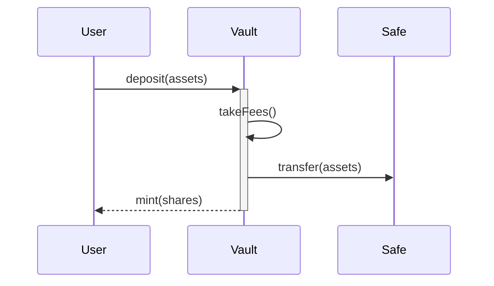
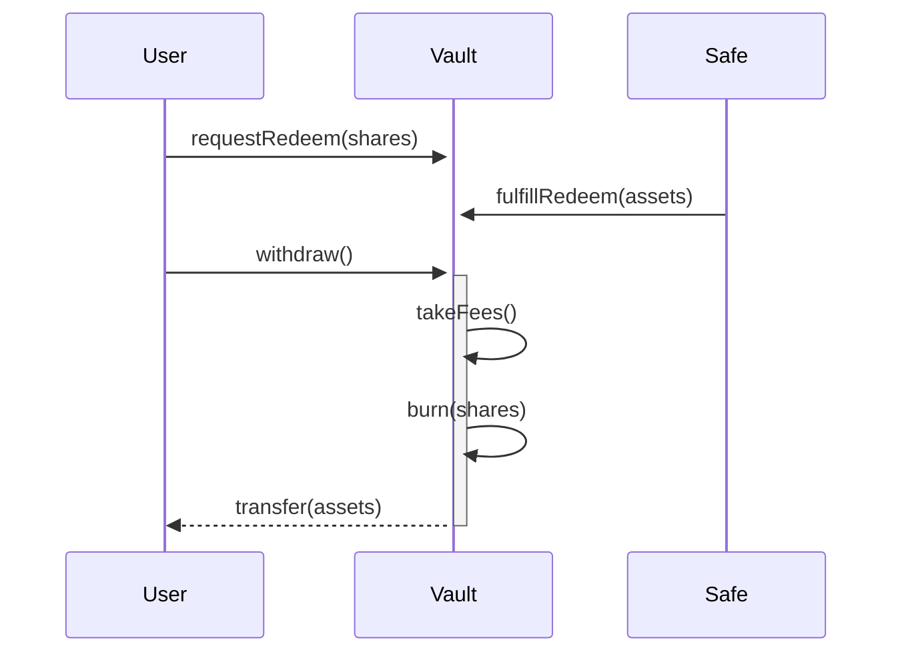

# Integration

To integrate vaults into your app follow these steps:

## 1. Get Vaults from API

Call our API `https://app.vaultcraft.io/api/vaults?chainId=[chainId]&account=[userAddress]` to get the vaults available on a given chain. If no user address is provided the API will use the zeroAddress.The return value looks like this:

```typescript
type VaultApiData = {
  address: Address; // vault address
  vault: TokenApiData;
  asset: TokenApiData;
  gauge?: TokenApiData; // optional gauge
  totalAssets: number;
  totalSupply: number;
  assetsPerShare: number; // (totalAssets / totalSupply)
  tvl: number; // total value locked in USD
  depositLimit: number; // maximum deposit amount
  withdrawalLimit: number; // maximum withdrawal amount
  minLimit: number; // minimum deposit amount
  idle: number; // assets not invested
  liquid: number; // assets available for synchronous withdrawal
  fees: {
    deposit: number; // in 1e18 (100% = 1e18)
    withdrawal: number; // in 1e18 (100% = 1e18)
    management: number; // in 1e18 (100% = 1e18)
    performance: number; // in 1e18 (100% = 1e18)
  };
  strategies: StrategyApiData[];
  baseApy?: number; // base apy of the vault without any boosts or rewwards
  minBoost?: number; // minimum boost apy if the vault got staked in its gauge (in OVCX)
  maxBoost?: number; // maximum boost apy if the vault got staked in its gauge (in OVCX)
  gaugeLowerApr?: number; // same as minBoost
  gaugeUpperApr?: number; // same as maxBoost
  rewards?: TokenReward[]; // optional additional rewards from the gauge
  metadata: VaultMetadata;
  points?: Points[]; // optional data for if the vault receives points
};

type TokenApiData = {
  address: Address;
  name: string;
  symbol: string;
  decimals: number;
  logoURI: string;
  balance: BalanceApiData;
  price: number;
  totalSupply: number;
  chainId?: number;
  type?: TokenType;
};

type BalanceApiData = {
  value: number;
  formatted: string;
  formattedUSD: string;
}

enum TokenType {
  Vault,
  Gauge,
  Asset,
}

type StrategyApiData = {
  allocation: number;
  totalAssets: number;
  totalSupply: number;
  idle: number;
};

type TokenReward = {
  address: Address;
  emissions: number;
  emissionsValue: number;
  apy: number;
};

type VaultMetadata = {
  vaultName?: string;
  labels?: VaultLabel[];
  description?: string;
  type:
    | "single-asset-vault-v1"
    | "single-asset-lock-vault-v1"
    | "multi-strategy-vault-v1"
    | "multi-strategy-vault-v2"
    | "multi-strategy-vault-v2.5"
    | "safe-vault-v1";
  creator: Address;
  feeRecipient: Address;
};

enum VaultLabel {
  experimental = "Experimental",
  deprecated = "Deprecated",
  new = "New",
  leverage = "Leverage",
  points = "Points",
}

type Point = {
  provider: string;
  multiplier: number;
};
```

Notice that vaults have different types. All vaults besides the `safe-vault-v1` follow the [ERC4626](https://eips.ethereum.org/EIPS/eip-4626) standard and can be easily integated like most other synchronous vaults.

Vaults of type `safe-vault-v1` build on the [ERC7540](https://eips.ethereum.org/EIPS/eip-7540) standard which is an asynchronous vault standard expanding on the ERC4626 standard. These vaults have synchronous deposits but withdrawals are processed asynchronously. This works similar to unstaking on Lido or Ethena and similar protocols which have a withdrawal period. Here you can see how ERC-7540 deposits and withdrawals work:

### Deposit

Deposits only have one state. On deposit the user sends funds to the `Vault` which in turn sends it to the `Safe`. The `Vault` than mints shares to the user.



### Withdraw

Withdrawals are processed asynchronously. Thefore we have multiple states of a withdrawal.

First a user requests a withdrawal by sending shares to the `Vault`. This is the `pending`-state. In which a withdrawal was started but not yet completed.

In the second step that request has to get fulfilled. By sending assets to the `Vault` and burning the users shares. Now the user has `claimable assets`. This is the `fulfilled`-state. The user has their shares burned but their assets reserved though these still need to be claimed.

Lastly the user can call `withdraw()` on the `Vault` to get their funds. This is the `completed`-state. Here the user simply claims and receives their assets.



## 2. Displaying the vaults

1. Use the `assetToken` to fetch icons to display the vault and `chainId` to fetch the network icon.
2. You can simply use the `vault.balance` entry to read a users balance and deposit value. If a vault uses a gauge add the `gauge.balance` to it.
Alternatively read a users vault balance like any other ERC-20 token and multiply it by the `assetsPerShare` to get the total assets the user has in the vault. You can further multiply that by the assets price to get the USD value of the users deposit. In case a vault uses a gauge and the user stakes in that gauge you need to read the users gauge balance instead of the vault balance.
3. Display the vaults tvl simply with the tvl value.
4. Display the vaults apy with the `baseApy` and add `minBoost` to it if the vault has a gauge. Its important to note that the user must stake their vault shares in the gauge to get the boost. (To display oVCX and its value use `https://app.vaultcraft.io/api/ovcx` endpoint. To convert oVCX into VCX send them to this page: `https://app.vaultcraft.io/boost`)
5. Deposits will fail if the are lower than the `minLimit` or higher than the `depositLimit`.
6. Withdrawals will fail if the are higher than the `withdrawalLimit`.

## 3. Depositing into the vaults

> 🚧 **Coming Soon**: We are working on API endpoint to simply return calldata for deposits and withdrawals. For the time beeing refer to the following content to interact with the vaults and gauges.

Use the `VaultRouter` to interact with the vaults and gauges in a simple fashion. You can find the addresses for all routers below:

```typescript
export const RouterByChain: AddressByChain = {
  [mainnet.id]: "0x7902c757a4A4B44C3B271Ce2f0c2A575C6D5f57A",
  [optimism.id]: "0x7902c757a4A4B44C3B271Ce2f0c2A575C6D5f57A",
  [arbitrum.id]: "0x7902c757a4A4B44C3B271Ce2f0c2A575C6D5f57A",
  [xLayer.id]: zeroAddress,
  [base.id]: "0x7902c757a4A4B44C3B271Ce2f0c2A575C6D5f57A",
  [fraxtal.id]: zeroAddress,
  [avalanche.id]: "0x7902c757a4A4B44C3B271Ce2f0c2A575C6D5f57A",
  [polygon.id]: zeroAddress,
  [bsc.id]: zeroAddress,
};
```

To deposit into a vault without gauge you simply approve the asset for the vault and call: 

```solidity 
vault.deposit(uint256 assetAmount)
```

To deposit into a vault with gauge approve the assets to the router and call:

```solidity
router.depositAndStake(address vault, address gauge, uint256 assetAmount, uint256 minOut, address user)
```

## 4. Withdrawals from the vaults

> 🚧 **Coming Soon**: We are working on API endpoint to simply return calldata for deposits and withdrawals. For the time beeing refer to the following content to interact with the vaults and gauges.

Withdrawals are slightly more complex since we have now four different paths. 
  - An ERC4626 vault with no gauge
  - An ERC4626 vault with a gauge
  - An ERC7540 vault with no gauge
  - An ERC7540 vault with a gauge
  
  Lets go over each of these:

### ERC4626 vault with no gauge

Simply call `redeem` to burn shares and get your assets.

```solidity
vault.redeem(uint256 shares)
```

### ERC4626 vault with gauge

Use the router to unstake and redeem in one transaction.

```solidity
router.unstakeAndWithdraw(address vault, address gauge, uint256 shares, uint256 minOut, address user)
```

### ERC7540 vault with no gauge

Request a withdrawal by calling the vault directly. This will start the withdrawal process and put the withdrawal into the `pending`-state.

```solidity
vault.requestRedeem(uint256 shares)
```

To read the pending withdrawal you must call the vault directly.

```solidity
(uint256 pendingShares, uint256 requestTime, uint256 claimableShares, uint256 claimableAssets) =  vault.getRequestBalance(address user);
```

To display the value of the pending withdrawal multiply `pendingShares` by the `assetsPerShare` get the amount of assets that are pending.

Then the vault manager will fulfill the withdrawal process. This will put the withdrawal into the `fulfilled`-state.

To display the withdrawable amount of assets you must call the vault directly.

```solidity
(uint256 pendingShares, uint256 requestTime, uint256 claimableShares, uint256 claimableAssets) =  vault.getRequestBalance(address user);
```

Simply display `claimableAssets` to give the user an information of how much they can withdraw.

At this point the user can call `withdraw()` on the vault to get their assets. This is the `completed`-state.

```solidity
vault.withdraw(uint256 shares)
```
This will burn the users shares and send the assets to the user.

### ERC7540 vault with gauge

First unstake and request a withdrawal via the router. This will start the withdrawal process and put the withdrawal into the `pending`-state.

```solidity
router.unstakeAndRequestWithdrawal(address gauge, address vault, address user, uint256 shares)
```

To read the pending withdrawal you must call the vault directly.

```solidity
(uint256 pendingShares, uint256 requestTime, uint256 claimableShares, uint256 claimableAssets) =  vault.getRequestBalance(address user);
```

To display the value of the pending withdrawal multiply `pendingShares` by the `assetsPerShare` get the amount of assets that are pending.

Then the vault manager will fulfill the withdrawal process. This will put the withdrawal into the `fulfilled`-state.

To display the withdrawable amount of assets you must call the vault directly.

```solidity
(uint256 pendingShares, uint256 requestTime, uint256 claimableShares, uint256 claimableAssets) =  vault.getRequestBalance(address user);
```

Simply display `claimableAssets` to give the user an information of how much they can withdraw.

At this point the user can call `withdraw()` on the vault to get their assets. This is the `completed`-state.

```solidity
vault.withdraw(uint256 shares)
```
This will burn the users shares and send the assets to the user.