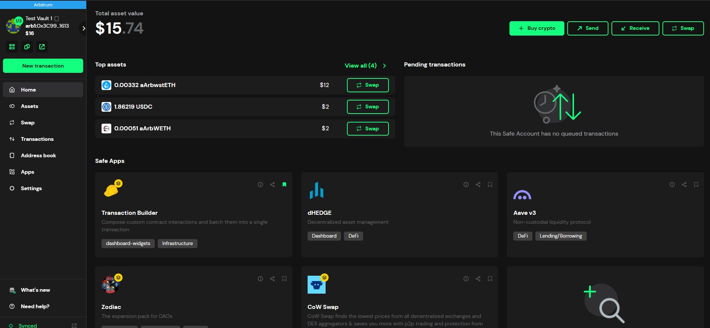
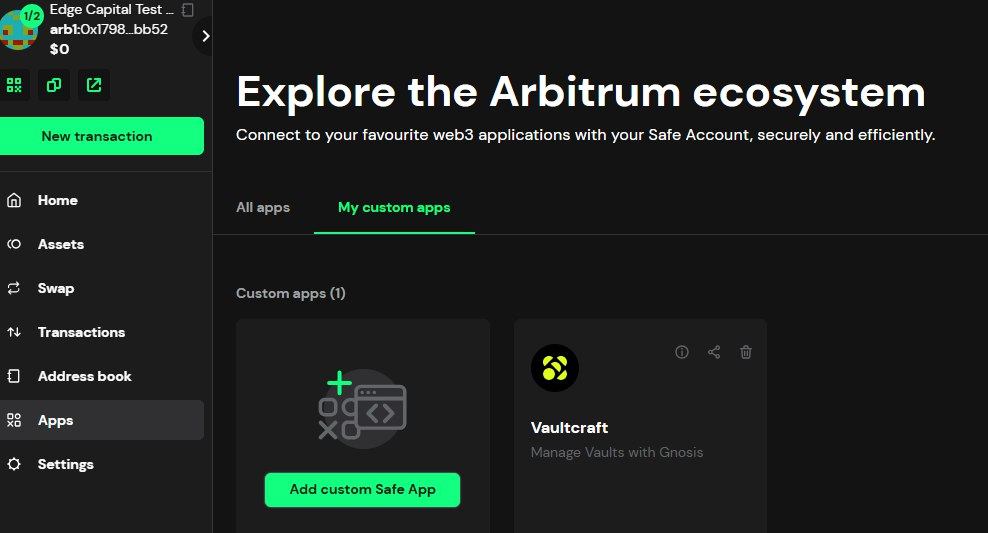
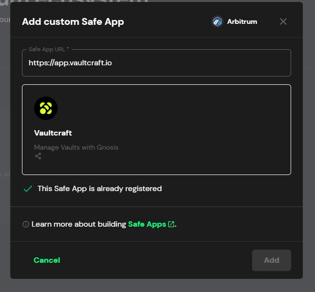
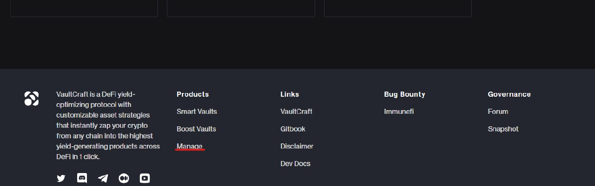
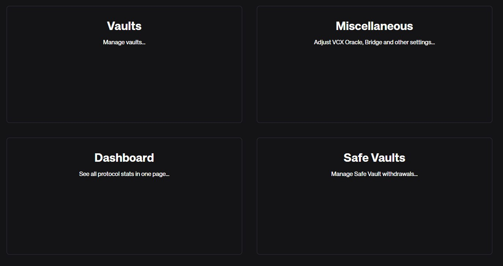
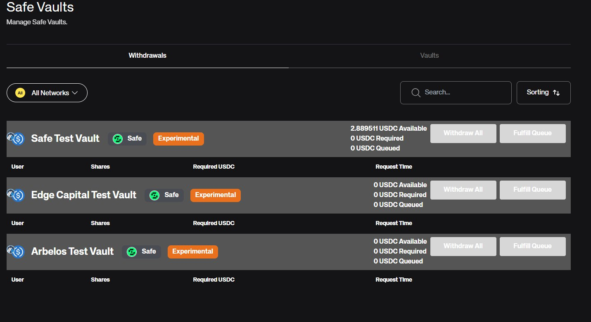
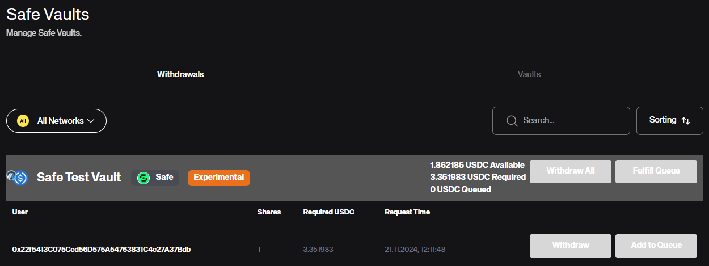

With our new Safe Vaults its easier than ever to run a vault/fund/index in DeFi.
We simply configure you a vault and set up a Gnosis Safe for you and from there on you can manage everything in the familiar interface of Safe with all the features that you come to love and expect.

## Vault Creation

1. Together we decide which asset will be the quote asset of the vault. The quote asset is the token that user deposit and withdraw. Therefore all price changes are measured in terms of this asset. Consider two examples:

    - The quote asset is USDC but the vault is now only holding BTC. With the price of BTC increasing the value of the vault in terms of USDC increases dramatically. Vice versa if the price of BTC decreases the value of the vault in terms of USDC decreases.
    - If the quote asset is BTC on the other hand the value of the vault wouldnt increase at all even if the price of BTC increases. Since the amount of BTC in the vault stays the same.

2. We decide together which protocols and assets can be used by the vault. This has a huge impact on the risk and return profile of the vault and how we can sell the vault to our users. A vault that only deals with established stablecoins and lending protocols will bring less returns but will be marketable to huge treasuries and other risk averse investors. While a vault that invests into Memecoins and various DeFi protocols will have a higher return potential but also higher risk. Its also important to note that we are able to later adjust the rules further in case VaultCraft or you as the manager feel like its necessary.

3. Now we deploy the vault with its oracle, safe and all necessary permissions.

4. You will be given access to a Gnosis Safe with a previously agreed EOA as the owner and ready to manage the vault.

## Vault Management

User funds are automatically send on deposit to your Gnosis Safe. The only thing you need to worry about is managing those assets and fulfilling withdrawal requests.

You can access any DeFi protocol either in the Safe app directly or by connecting to an app via WalletConnect. Any protocol or asset interaction that wasnt allowed on vault creation will simply fail or not be signed.

Its also possible to use the Safe API or Safe SDK to interact with the Safe in a programmatic way. (https://docs.safe.global/sdk/overview)

To fulfill user withdrawals follow the following steps:
1. Navigate to the `Apps`-page in the Gnosis Safe and there click on "My custom apps". If you see VaultCraft in that list already you can skip step 2 and go straight to step 3.

2. Click on `Add custom Safe App` and add the following URL: https://app.vaultcraft.io and click `Add`. This will add the VaultCraft to your list of Safe Apps.

3. Now click on the VaultCraft app and scroll to the bottom of the page. Click on `Manage`.

4. This sends you to this page where you click on `Safe Vaults`

5. Here you can see all withdrawal requests from all users of any VaultCraft vault. You can use the search functionality or narrow vaults down by selecting specific networks to only see your vaults.

6. Here you can see a user which address ends with `...Bdb` has requested the withdrawal of 1 vault share which is currently valued at 3.51983 USDC. You also see this in the gray bar at the top. This shows you how many idle USDC are in the Safe and how many you would need to fulfill all withdrawal requests. In this case we have 1.82 USDC available but need 3.519 USDC. In this example you would need to withdraw from some protocols or sell other tokens in the Safe to get the needed USDC.

7. Withdrawals can be fulfilled in multiple ways. By clicking on the `Withdraw` button next to individual requests you fulfill that specific request only. You can also click on `Withdraw all` to fulfill all requests at the same time for a single vault if the Safe has enough idle assets. Lastly you can bundle multiple requests of the same vault by clicking on `Add to Queue` and then `Fulfill Queue`. When adding a request to the queue you will see that the amount of Queued Assets in the Gray bar at the top increases. And thats all there is to manage a vault. 

