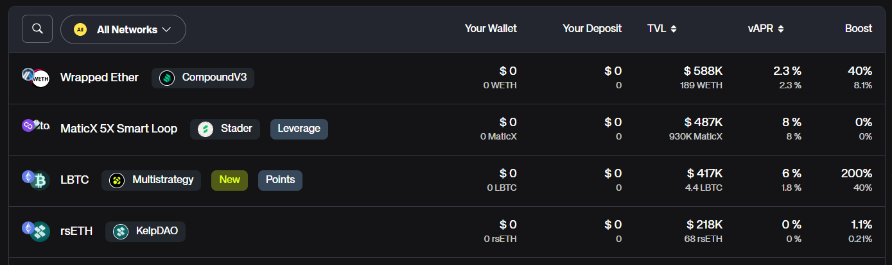
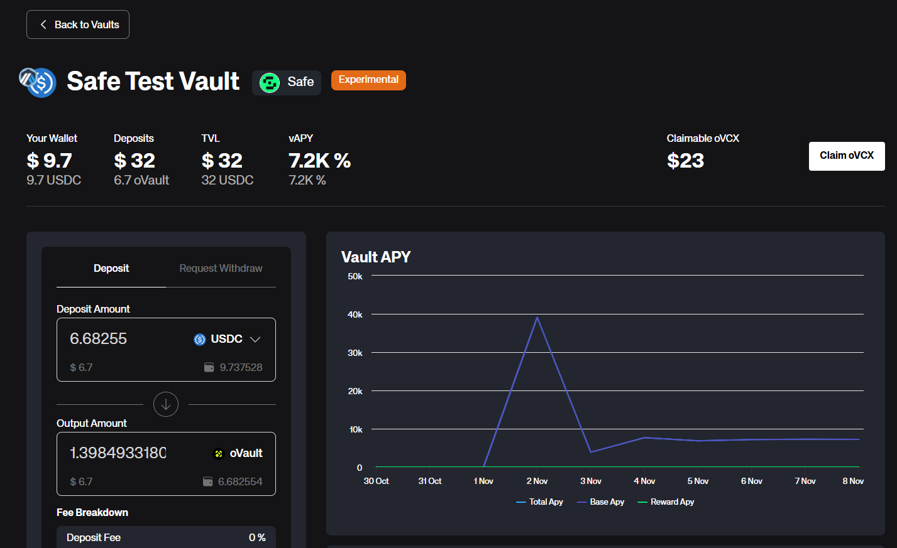
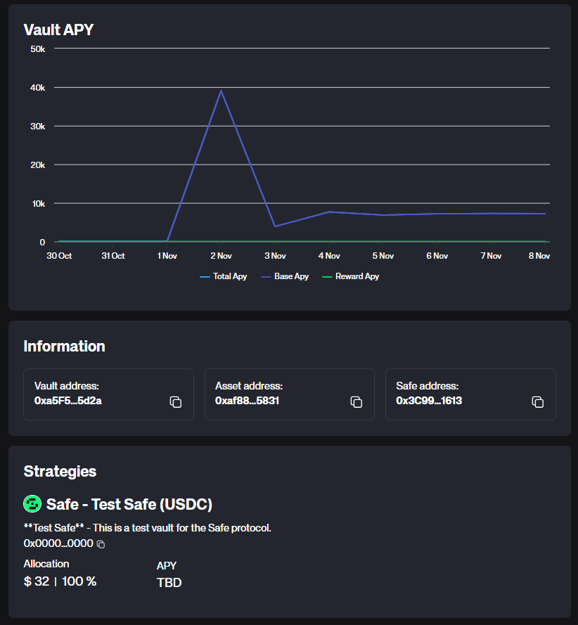
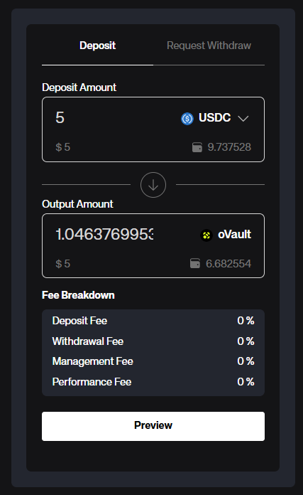
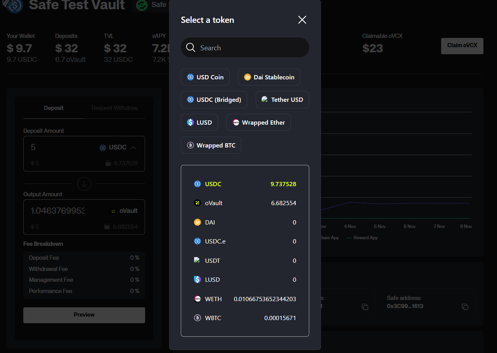
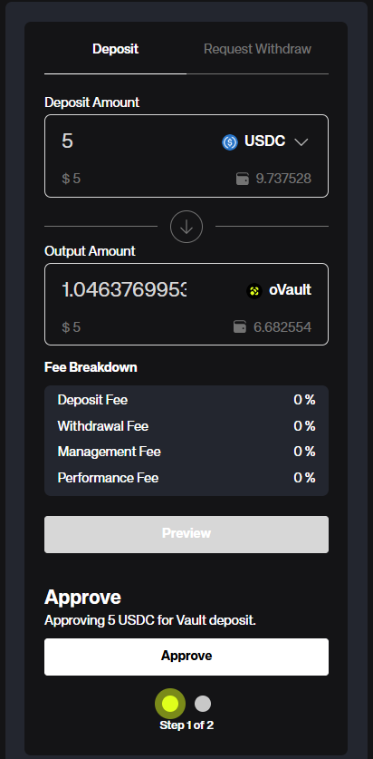
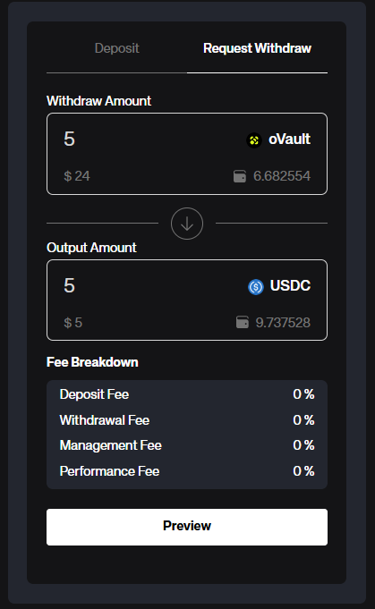
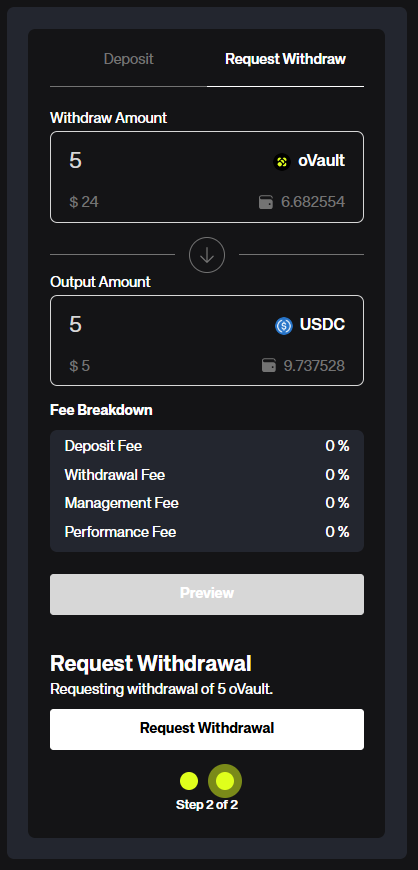
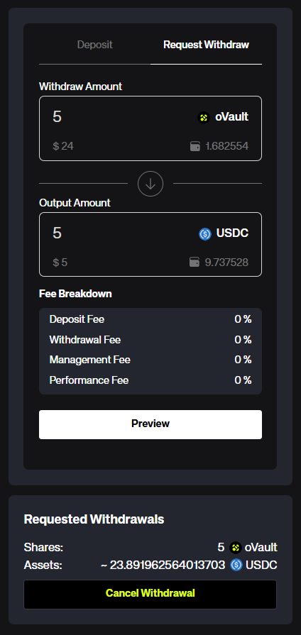
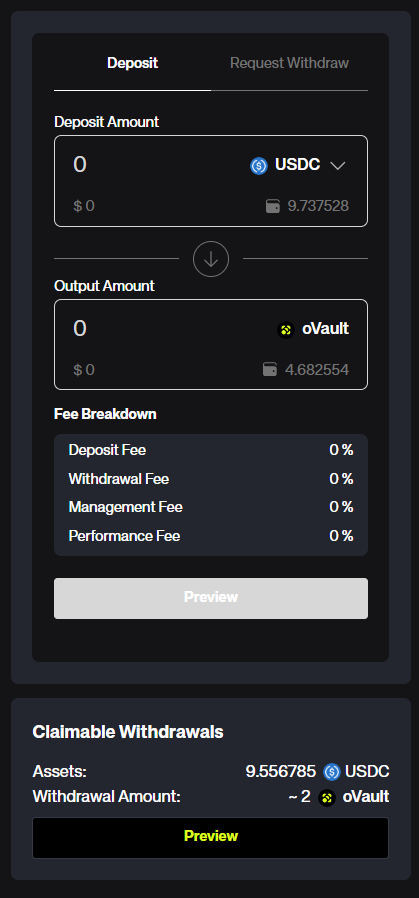

## Deposit
1. Select a vault that supports tokens you want to deposit and click on it. You can also use the search bar to find a specific vault by asset, address or name. If you want to see vaults only on specific chains, use the 'All Networks'-dropdown. If you need more informations about specific data points simply hover over them.

2. Once you clicked on a vault you will see more details about it.

2.1. On top you see the asset icon used by the vault and the network on which it is deployed. Next to it you see the vaults name, the strategies it uses and additional tags. (This vault for example uses USDC on Arbitrum and uses the `Safe`-strategy).

2.2. Below the vaults name you see the how many tokens you can deposit and the current value of your vault deposit. Next to it you find the TVL (Total Value Locked) of the vault and its variable APY. As usual if you need more informations about specific data points simply hover over them.

3. You can inspect the historical performance of the vault by inspecting the `Vault APY`-chart. Below that you find various informations from a description to all the necessary addresses of the vault if you want to dig into it further. Lastly in the `Strategies`-section you can see which strategies are used and how much they contribute to the vaults performance.

4. Next to all these informations you find the `Deposit/Withdraw`-section. In here you can deposit and withdraw tokens to and from the vault.

4.1. Type in the amount of tokens you want to deposit. Below it you see the value of your pending deposit in USD. The number next to the wallet icons shows you how much of the selected token you have in your wallet. Click on the wallet icon to to use your whole balance.

4.2. If you click on the arrow next to the asset name you can select a different token to use for your deposit. We will automatically convert the token on deposit into the vaults underlying token.

4.3. Below that you find the estimated amount of vault shares you will receive for your deposit. There you can also see the value of those shares in USD and how many vault shares you already own. Over time these vault shares will grow in value depending on the vaults performance. You can later withdraw your vault shares to get back the underlying tokens plus interest.

4.4. Lastly you find the fee breakdown of the vault. Once you are ready go ahead and click on the `Preview`-button to start your deposit.

4.5. Follow the steps shown to finish up your deposit.

## Withdraw
1. In the same way as for deposits you select a vault from the overview which you want to withdraw from. That directs you to the vault details page. Here we now switch the tab from "Deposit" to "Withdraw" by clicking on `Request Withdraw`.

1.1 Here you type in amount of vault shares to withdraw. Below it you see the value of your withdrawal in USD. Next to it we can see how many shares you have in your wallet. Click on the wallet icon to use your whole balance.

1.2. Below at `Output Amount` you can see the estimated amount of tokens you will receive for your withdrawal, their value in USD and how many tokens you already have in your wallet.

1.3. Lastly you find the fee breakdown of the vault. Once you are ready go ahead and click on the `Preview`-button to start your withdrawal.

1.4. Follow the steps shown to finish up your withdrawal. Its important to note that depending on the vaults strategy some withdrawals might take a while to complete. This will be shown clearly in the withdrawals steps. If there is enough liquidity for a full withdrawal you can stop reading here.

2. Your withdrawal is now in process. You can see your requested withdrawal below the Deposit/Withdraw-section. It shows you the amount of vault shares you are withdrawing and the estimated amount of tokens you will receive. If you want to cancel your withdrawal you can click on the `Cancel`-button.

3. Once the withdrawal from the vault is completed you can claim your tokens by clicking on the `Preview`-button and follow the steps shown.

